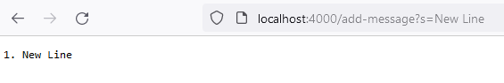
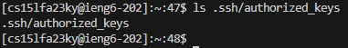

# Part 1
- Before the call of "/add-message":


- After we firstly load webpage we go into url *http://localhost:4000/*, which is deffault page. As soon as we entered the ulr, we call a *handeRequst* methood, which has an input of *URI* which is a continer class which includes path and query of url, user info, and so on. So when we send another request on server, like calling "/add-message", we change a path and query String values in *URI* object.

---
- After the call of "/add-message":



- After our call of "/add-message", as mentioned before we changed values in *URI* object what our *handeRequst* methood proceeds. As well as we add adittional String entry to our *stringList*, which is list of all enetries entered by the user. 
---

Code for **StringServer.java**:
```java
import java.io.IOException;
import java.net.URI;
import java.util.List;
import java.util.ArrayList;

class Handler implements URLHandler {
    List<String> stringList = new ArrayList<String>();

    public String handleRequest(URI url) {
        if (url.getPath().equals("/")) {
            return getListFormated(stringList);
        } else {

            if (url.getPath().contains("/add-message")) {
                String[] parameters = url.getQuery().split("=");
                if (parameters[0].equals("s")) {
                    stringList.add(parameters[1]);
                    return getListFormated(stringList);
                }
            }

            return "404 Not Found!";
        }
    }


    private String getListFormated(List<String> input) {
        int lineNum = 1;
        String result = new String();
        for (String element : input) {
            result += lineNum + ". " + element + "\n";
            lineNum++;
        }
        return result;
    }
}


class StringServer {
    public static void main(String[] args) throws IOException {
        if(args.length == 0){
            System.out.println("Missing port number! Try any number between 1024 to 49151");
            return;
        }

        int port = Integer.parseInt(args[0]);

        Server.start(port, new Handler());
    }
}

```
---
# Part 2





---
# Part 3
I already had experience working with **scp**, **ssh** and outher commands in bash terminal. But one thing what impressed me is Java HttpServer framework. I simply didn't know that on java you can actually realize such actions as handling an URL and hosting a server. So it was extremely engaging to play around with it.

